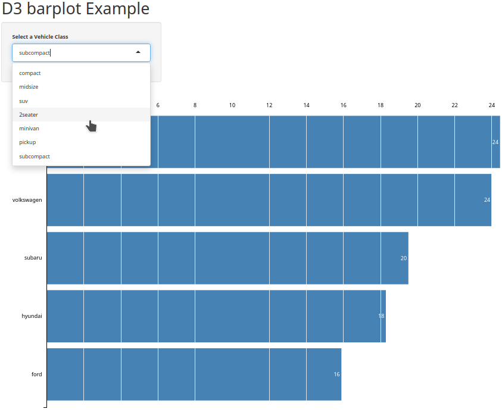

# The structure of files

## `ui.R`

```{r, eval=FALSE}

library(shiny)

# Define UI for application that draws a histogram
fluidPage(
  
  #Bring in the style sheet from the www folder
  tags$head(tags$link(rel = "stylesheet", 
                      type = "text/css", href = "style.css")),
  
  #Tell shiny what version of d3 we want
  tags$script(src='//d3js.org/d3.v3.min.js'),
  
  
  # Application title
  titlePanel("D3 and R, a match made in heaven"),
  
  # Sidebar with a slider input for number of bins
  sidebarLayout(
    sidebarPanel(
      
      #Dropdown list with the vehicle classes  
      selectInput(inputId = "vehicleClass",
                  label = 'Select a Vehicle Class',
                  choices = c('','compact', 'midsize', 'suv', 
                              '2seater', 'minivan', 'pickup', 'subcompact'),
                  selected = ''
      )
      
    ),
    
    # Show a plot of the generated distribution
    mainPanel(
      #The d3 graph
      uiOutput("d3")
      
    )
  )
)

```


## `server.R`

```{r, eval=FALSE}
library(shiny)

# Define server logic required to draw a histogram
function(input, output, session) {
  
  #Lets look for changes in our vehicle class dropdown then crunch the data and serve it to D3
  observeEvent(input$vehicleClass, {
    
    #Use tidyverse to slice the data based on the drop down input
    dfMpg <- mpg %>% 
      filter(class == input$vehicleClass) %>% 
      group_by(manufacturer) %>% 
      mutate(avgCity = mean(cty)) %>% 
      select(manufacturer, avgCity) %>% 
      unique() %>% 
      rename(name = manufacturer, value = avgCity)
    
    #Convert the tibble to json
    jsonMpg <- toJSON(dfMpg, pretty=TRUE)
    
    #Send that json from the session to our javascript
    session$sendCustomMessage(type="jsondata",jsonMpg)
    
  }, ignoreNULL = FALSE,ignoreInit = FALSE)
  
  #This tells shiny to run our javascript file "script.js" and send it to the UI for rendering
  output$d3<- renderUI({
    HTML('<script type="text/javascript", src="script.js">  </script>')
  })
  
}

```


## `www/stlyse.css`

```{css, eval=FALSE}
body {
font: 10px sans-serif;
}

.bar rect {
fill: steelblue;
}

.bar text.value {
fill: white;
}

.axis {
shape-rendering: crispEdges;
}

.axis path {
fill: none;
}

.x.axis line {
stroke: #fff;
stroke-opacity: .8;
}

.y.axis path {
stroke: black;
}

```


## `www/script.js`

```{js, eval=FALSE}
//Wrap the entire D3 script in this function. It is looking for a jsondata message sent from Shinys server session object.
Shiny.addCustomMessageHandler('jsondata', function(message) {
    //Lets nuke out any thing on our page with the id of "d3Graph". This will prevent 
    //our app from making a new graph each time a parameter is changed
    d3.select("#d3Graph").remove();

    //The message comes from shiny, it is the json payload from our session
    var data = message;

    //Set the margin, width, and height of the D3 SVG
    var m = [30, 10, 10, 100],
        w = 960 - m[1] - m[3],
        h = 600 - m[0] - m[2];

    var format = d3.format(",.0f");

    //Set the axis
    var x = d3.scale.linear().range([0, w]),
        y = d3.scale.ordinal().rangeRoundBands([0, h], .1);

    var xAxis = d3.svg.axis().scale(x).orient("top").tickSize(-h),
        yAxis = d3.svg.axis().scale(y).orient("left");//.tickSize(0);

    //This is the shell of the SVG. It gets the id of "d3Graph". Every time this script is called
    //it will nuke out any svg named d3graph and create a new one.     
    var svg = d3.select("body").append("svg")
        .attr("width", w + m[1] + m[3])
        .attr("height", h + m[0] + m[2])
        .attr("id", "d3Graph")
        .append("g")
        .attr("transform", "translate(" + m[3] + "," + m[0] + ")");

    //We have a d3 graph, but we need to bind data to it. 
    data.forEach(function(d) {
        d.name  =  d.name;
        d.value = +d.value;
      });

    data.sort(function(a, b) { return b.value - a.value; });

    //Set the scale.
    x.domain([0, d3.max(data, function(d) { return d.value; })]);
    y.domain(data.map(function(d) { return d.name; }));

    //Make the chart
    var bar = svg.selectAll("g.bar")
        .data(data)
        .enter().append("g")
        .attr("class", "bar")
        .attr("transform", function(d) { return "translate(0," + y(d.name) + ")"; });

    bar.append("rect")
        .attr("width", function(d) { return x(d.value); })
        .attr("height", y.rangeBand());

    //Labels are good.         
    bar.append("text")
        .attr("class", "value")
        .attr("x", function(d) { return x(d.value); })
        .attr("y", y.rangeBand() / 2)
        .attr("dx", -3)
        .attr("dy", ".35em")
        .attr("text-anchor", "end")
        .text(function(d) { return format(d.value); });

    svg.append("g")
        .attr("class", "x axis")
        .call(xAxis);

    svg.append("g")
        .attr("class", "y axis")
        .call(yAxis);
});

```

## Screenshot

