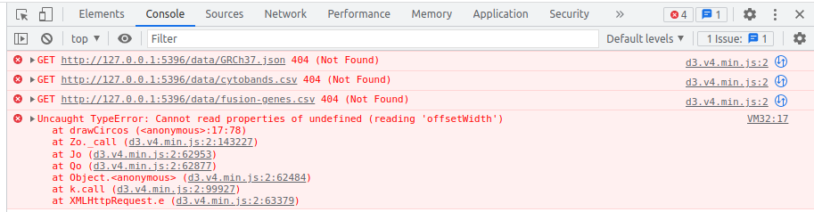

```{r setup, include=FALSE}
knitr::opts_chunk$set(echo = TRUE)
```

## styles.css

```{css, eval=FALSE}
html, body {
  font-family: 'Roboto', 'Helvetica', sans-serif;
  margin: 0;
  padding: 0;
}
.mdl-demo .mdl-layout__header-row {
  padding-left: 40px;
}
.mdl-demo .mdl-layout.is-small-screen .mdl-layout__header-row h3 {
  font-size: inherit;
}
.mdl-demo .mdl-layout__tab-bar-button {
  display: none;
}
.mdl-demo .mdl-layout.is-small-screen .mdl-layout__tab-bar .mdl-button {
  display: none;
}
.mdl-demo .mdl-layout:not(.is-small-screen) .mdl-layout__tab-bar,
.mdl-demo .mdl-layout:not(.is-small-screen) .mdl-layout__tab-bar-container {
  overflow: visible;
}
.mdl-demo .mdl-layout__tab-bar-container {
  height: 64px;
}

....
```


## chords.js

```{js, eval=FALSE}
var gieStainColor = {
  gpos100: 'rgb(0,0,0)',
  gpos: 'rgb(0,0,0)',
  gpos75: 'rgb(130,130,130)',
  gpos66: 'rgb(160,160,160)',
  gpos50: 'rgb(200,200,200)',
  gpos33: 'rgb(210,210,210)',
  gpos25: 'rgb(200,200,200)',
  gvar: 'rgb(220,220,220)',
  gneg: 'rgb(255,255,255)',
  acen: 'rgb(217,47,39)',
  stalk: 'rgb(100,127,164)',
  select: 'rgb(135,177,255)'
}

var drawCircos = function (error, GRCh37, cytobands, data) {
  var width = document.getElementsByClassName('mdl-card__supporting-text')[0].offsetWidth
  var circos = new Circos({
    container: '#chordsChart',
    width: width,
    height: width
  })

  cytobands = cytobands.map(function (d) {
    return {
      block_id: d.chrom,
      start: parseInt(d.chromStart),
      end: parseInt(d.chromEnd),
      gieStain: d.gieStain,
      name: d.name
    }
  })

  data = data.map(function (d) {
    return {
      source: {
        id: d.source_id,
        start: parseInt(d.source_breakpoint) - 2000000,
        end: parseInt(d.source_breakpoint) + 2000000
      },
      target: {
        id: d.target_id,
        start: parseInt(d.target_breakpoint) - 2000000,
        end: parseInt(d.target_breakpoint) + 2000000
      }
    }
  })

  circos
    .layout(
      GRCh37,
    {
      innerRadius: width/2 - 80,
      outerRadius: width/2 - 40,
      labels: {
        radialOffset: 70
      },
      ticks: {
        display: true,
        labelDenominator: 1000000
      },
      events: {
        'click.demo': function (d, i, nodes, event) {
          console.log('clicked on layout block', d, event)
        }
      }
    }
    )
    .highlight('cytobands', cytobands, {
      innerRadius: width/2 - 80,
      outerRadius: width/2 - 40,
      opacity: 0.3,
      color: function (d) {
        return gieStainColor[d.gieStain]
      },
      tooltipContent: function (d) {
        return d.name
      }
    })
    .chords(
      'l1',
      data,
    {
      radius: function (d) {
        if (d.source.id === 'chr1') {
          return 0.5
        } else {
          return null
        }
      },
      logScale: false,
      opacity: 0.7,
      color: '#ff5722',
      tooltipContent: function (d) {
        return '<h3>' + d.source.id + ' ➤ ' + d.target.id + ': ' + d.value + '</h3><i>(CTRL+C to copy to clipboard)</i>'
      },
      events: {
        'mouseover.demo': function (d, i, nodes, event) {
          console.log(d, i, nodes, event.pageX)
        }
      }
    }
    )
    .render()
}

d3.queue()
  .defer(d3.json, './data/GRCh37.json')
  .defer(d3.csv, './data/cytobands.csv')
  .defer(d3.csv, './data/fusion-genes.csv')
  .await(drawCircos)

```


## ui.R

```{r, eval=FALSE}

shinyUI(
  fluidPage(
    tags$head(
      #Tell shiny what version of d3 we want
      tags$script(src='//d3js.org/d3.v4.min.js')
      ),
      #includeScript("d3.min.js")),
                  includeCSS('styles.css'),
                  mainPanel(uiOutput("chords"))
))

```

## server.R

```{r, eval=FALSE}
library(shiny)

shinyServer(function(input, output, session) {
  output$chords <- renderUI({
    includeScript('chords.js')
  })
  
  # stop app if session is ended
  session$onSessionEnded(function() {
    stopApp()
    print(" Chords session is ended!")
  })
})
```


## Error


