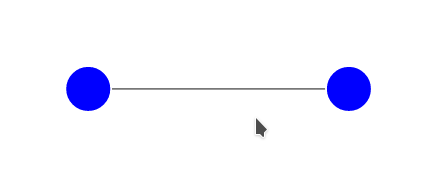

## style.css

```{css , eval=FALSE}
.node {
    fill: #ccc;
    stroke: #fff;
    stroke-width: 2px;
}

.link {
    stroke: #777;
    stroke-width: 2px;
}
```


## force_network.js

```{js, eval=FALSE}
var width = 640,
    height = 480;

var nodes = [
    { x:   width/3, y: height/2 },
    { x: 2*width/3, y: height/2 }
];

var links = [
    { source: 0, target: 1 }
];

var svg = d3.select('body').append('svg')
    .attr('width', width)
    .attr('height', height);

var force = d3.layout.force()
    .size([width, height])
    .nodes(nodes)
    .links(links);

force.linkDistance(width/2);

var link = svg.selectAll('.link')
    .data(links)
    .enter().append('line')
    .attr('class', 'link');

var node = svg.selectAll('.node')
    .data(nodes)
    .enter().append('circle')
    .attr('class', 'node');
force.on('end', function() {
    node.attr('r', width/25)
        .attr('cx', function(d) { return d.x; })
        .attr('cy', function(d) { return d.y; });
    link.attr('x1', function(d) { return d.source.x; })
        .attr('y1', function(d) { return d.source.y; })
        .attr('x2', function(d) { return d.target.x; })
        .attr('y2', function(d) { return d.target.y; });
});
force.start();


```


## ui.R

```{r, eval = FALSE}
library(shiny)

shinyUI(
  fluidPage(
    tags$head(
      #Tell shiny what version of d3 we want
      tags$script(src='//d3js.org/d3.v3.min.js')
      ),
      #includeScript("d3.min.js")),
                  includeCSS('style.css'),
                  mainPanel(uiOutput("chart"))
))
```

## server.R

```{r, eval=FALSE}

library(shiny)

shinyServer(function(input, output) {
  output$chart <- renderUI({
    includeScript('force_network.js')
  })
  
    # stop app if session is ended
  session$onSessionEnded(function() {
    stopApp()
    print(" force network session is ended!")
  })
})
```


